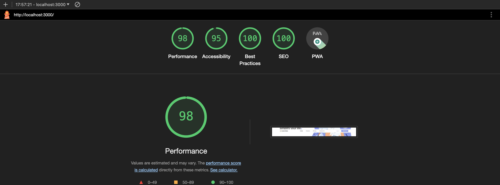

# [Acme Notes](https://programmergaurav-acme-notes.netlify.app)  
This is Acme notes, it has a landing page, features and a testimonials section and a animated navbar, which animates on scroll.

## Framework and packages used
  - ReactJS
  - Bootstrap (responsive UI)
  - React Slick (testimonials slider animation)
  - Bootstrap Icons
  - SASS

## Performance

## Optimizations
 - Converted images to webp format and optimized it to loads faster
 - Only used important libiraries not installed any major lib which increased the bundle size

### Things can I do to improve performance
 - Remove bootstrap css library, I can use css and I will not need to import useless css and js codes